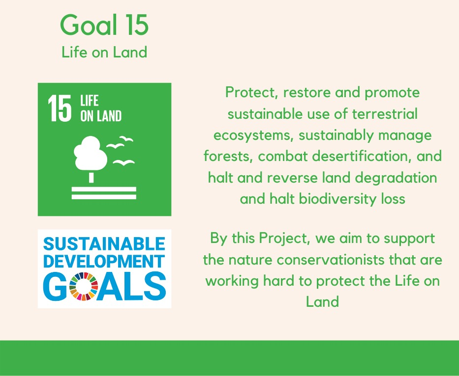

This Repository contains the Web-Based Contributions made by me for this Project.

## Glow-Green 

Identifying and classification of Leaf Diseases using Tensorflow Object Detection by Google

## Understanding Problem Statement

Over the years 2 billion hectares of Forest land on earth has degraded, affecting some 3.2 billion people and driving species to extinction and intensifying climate change. Recent studies have proved that disease infestations are one of the major factors behind the decaying of plants and forests. A major factor behind these infestations are invading alien species or parasites that harm our valuable forests. With the help of Data Science and Machine Learning, it is possible to identify the diseases so that appropriate measures can be taken at the correct instance of time to sustainably manage forests, combat desertification, halt and reverse land degradation, and halt biodiversity loss.

## Motive

Existing methods of disease detection require environmentalists and forest-workers to solicit the help of government-funded agricultural experts to visually inspect and diagnose the infested leaf diseases. This suffers from being labor-intensive, low-supply and costly. As an added challenge, effective solutions for concerned people must perform well under significant constraints, since people may only have access to mobile-quality cameras with low-bandwidth.

## Tech Stack Used

## DL Architectures Used

- EfficientDet-Lite0 Object detection model
- TFOD API
- TFlite
